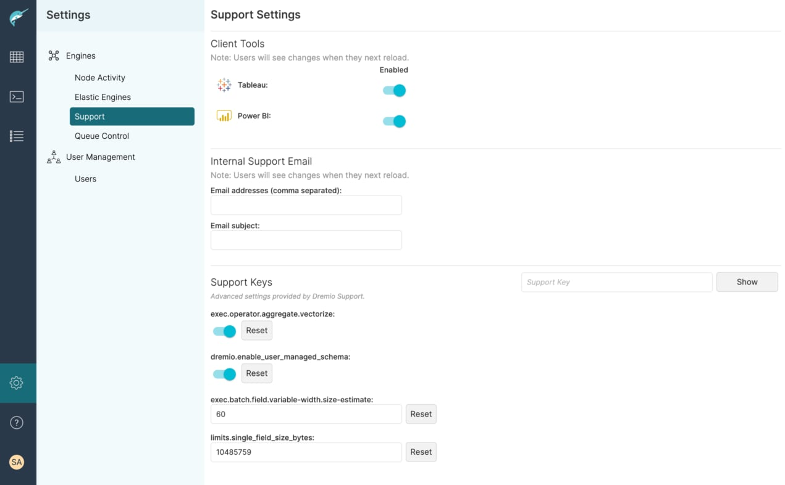

[# GIS Extensions for Dremio

| Tested Dremio Versions | Author                            |
|------------------------|-----------------------------------|
| 19.1.0 to 24.3.2       | Brian Holman <bholman@dezota.com> |
]()
*This independent project is not affiliated with, sponsored, or endorsed by Dremio Corporation. Dremio is a registered trademark of Dremio Corporation and they retain all trademark and other intellectual property rights.  Dremio is used here by reference to integrating with their published [User-Defined Functions Specification](https://www.dremio.com/hub-additional/) for advanced users to develop their own custom functions for use in SQL queries.*


The **GIS Extensions** allow Dremio to perform standard GIS functions within Dremio SQL with 76 industry-standard GIS functions and 21 H3 index functions. These extensions use the [*Esri Java Geometry Library*](https://github.com/Esri/geometry-api-java/wiki/) for the underlying implementation of the core geometry functions.  The [Java Bindings](https://github.com/uber/h3-java.git) for the [Uber H3 Library](https://h3geo.org/) were used to implement the H3 functions. The author made heavy use of Esri's [*Spatial Framework for Hadoop*](https://github.com/Esri/spatial-framework-for-hadoop) as a reference for a similar implementation that also relies on the same library.

There were two significant gaps in the Geometry Library supplied by Esri that limited transforming geometries from `EPSG: 4326` to other coordinate systems and performing geodesic rather than 2D area and length calculations. Geodesic area function helpers backing the `ST_GeodesicAreaWGS84` function are copied almost exactly from the [*Trino Geospatial Library*](https://github.com/trinodb/trino/tree/master/plugin/trino-geospatial) as found in our `FunctionHelpers.stSphericalArea()` and `FunctionHelpers.computeSphericalExcess()`. Conversion to other coordinate systems in the `ST_Transform` function leverages the [Proj4J Library](https://trac.osgeo.org/proj4j/). All of the referenced works are also published under the *Apache 2.0 License*.

## Usage and Available Functions

View the [SQL Function Reference](./docs/sqlFunctions.md) for definitions, syntax, and examples of the functions implemented or [download the PDF](./docs/DremioGISExtFuncRef.pdf).

## Building and Installation

1. In root directory with the pom.xml file run `mvn clean install`
2. Take the resulting `target/dremio-gis-extensions-*.jar` file put it in the `/opt/dremio/jars` folder of your Dremio
   installation.
3. Restart Dremio

## Docker Instructions

1. The `target/dremio-gis-extensions-*.jar.jar` is copied into the `docker/build` folder by Maven.
2. In the `docker` directory, run `docker-compose build` to take the base Dremio Docker Image and add the new
   extensions.
3. Run `docker-compose up` to start the new image.

## Docker Image (on Docker Hub or build yourself)
See [Dremio Docker Build with Dezota Extensions](https://github.com/Dezota/dremio-docker-with-extensions) for a complete solution that includes built-in documentation for all GIS functions when using the *Dremio Analyst Center* UI.  The updated support key values described below have been changed from the previous defaults. 

## Recommended Support Key Settings for GIS Extensions in Dremio 🤫



Paste the following keys in the `Settings > Support` screen in Dremio and update the default values to the ones below:
```
limits.single_field_size_bytes = 10485759
exec.batch.field.variable-width.size-estimate = 60
```
## Emerging GeoParquet Standard

* [GeoParquet](https://github.com/opengeospatial/geoparquet) - the native binary format of these GIS functions is compatible with this standard.
  * Try uploading [nz-buildings-outlines.parquet](https://storage.googleapis.com/open-geodata/linz-examples/nz-buildings-outlines.parquet) from their example set into Dremio.  Here is an example query on that dataset's geometry column:

```sql
SELECT ST_AsText(geometry) AS geometry_wkt,
    ST_GeodesicAreaWGS84(ST_Simplify(geometry))/4047 AS area_acres
FROM "minio-storage"."dremio-user-storage"."nz-buildings-outlines.parquet"
```

## Inspiration

* Esri Open Source Libraries
  * https://github.com/Esri/spatial-framework-for-hadoop
  * https://github.com/Esri/geometry-api-java
* [Uber H3 Library](https://h3geo.org/)
  * [Java Language Bindings](https://github.com/uber/h3-java)
  * [Analytics Toolbox for BigQuery](https://github.com/CartoDB/analytics-toolbox-core/tree/master/modules/h3/bigquery)
* [Algorithms for geodesics by Charles F. F. Karney](https://arxiv.org/pdf/1109.4448.pdf)
  * https://github.com/geographiclib/geographiclib/tree/main/java
* [Trino Geospatial Toolkit](https://github.com/trinodb/trino/tree/master/plugin/trino-geospatial)
* [Geodesic intersection: proposed algorithm and error assessment of current software](https://cartosig.webs.upv.es/2021/07/27/geodesic-intersection-proposed-algorithm-and-error-assessment-of-current-software/)
  * [Geodesic Spatial Operators on the ellipsoid](https://github.com/jomarlla/geodesicSpatialOperators)
  * [Research Paper PDF](https://www.mdpi.com/2076-3417/11/11/5129/pdf)
* Earlier Incomplete Attempts to implement GIS support
  * https://github.com/christyharagan/dremio-gis
  * https://github.com/k255/drill-gis

## Dependencies

The ```com.esri.geometry:esri-geometry-api```,```org.osgeo:proj4j```, and ```com.uber:h3``` libraries are required and not installed in
Dremio. The first two are automatically included as shade jars in the final jar with the maven build process and don't need to be
included separately in `/opt/dremio/jars/3rdparty`.  The third library needs to be copied into the `3rdparty` folder.  This is because our
default docker image requires a rebuild of the native H3 library.  See [docker-h3-java-build](./docker-h3-java-build/README.md) for details.
